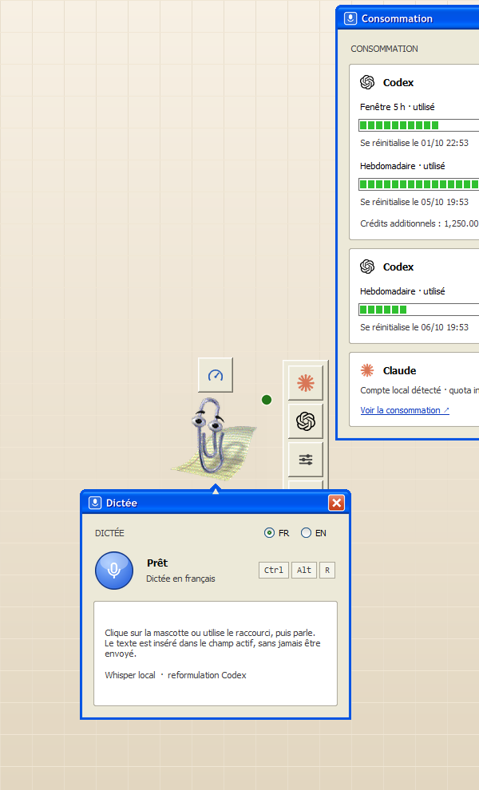
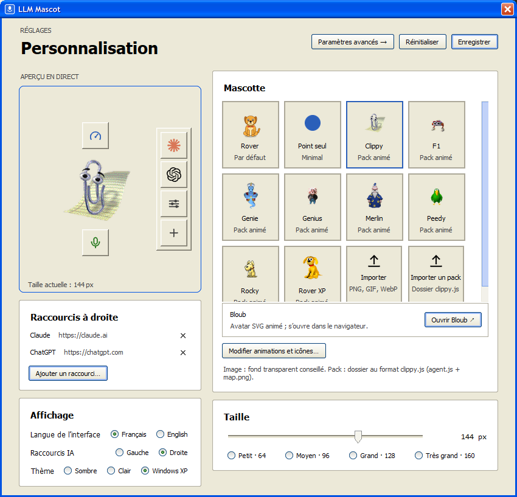
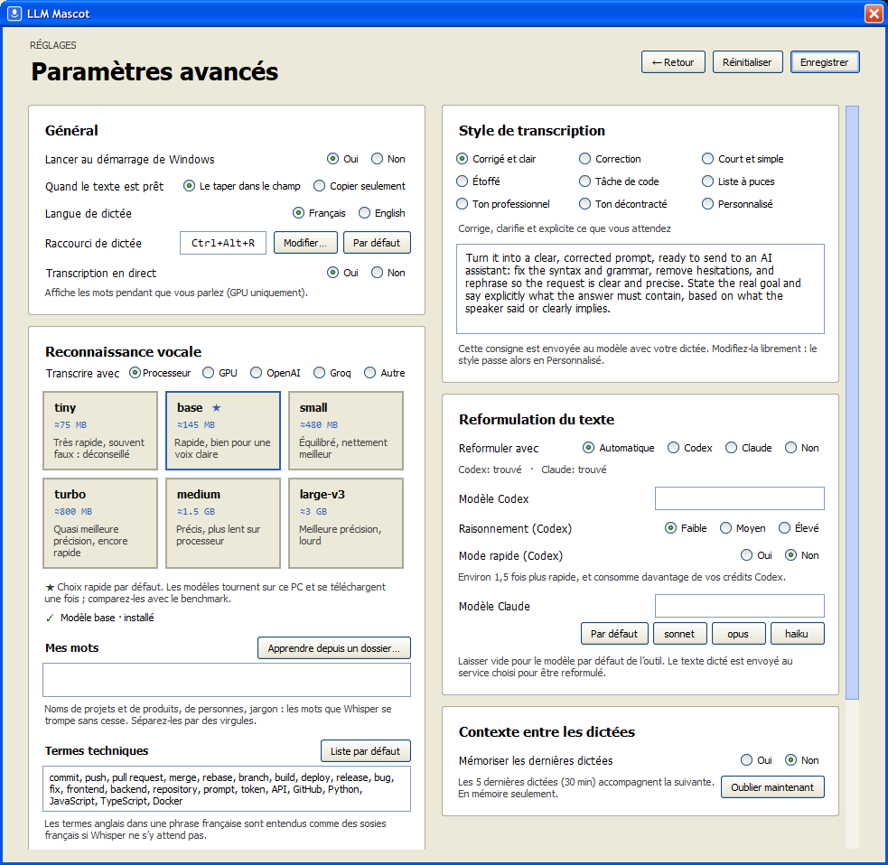
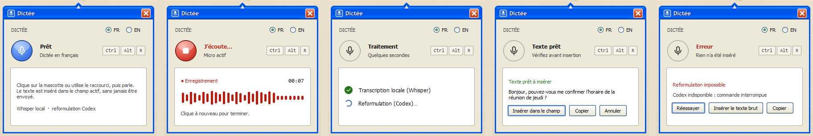
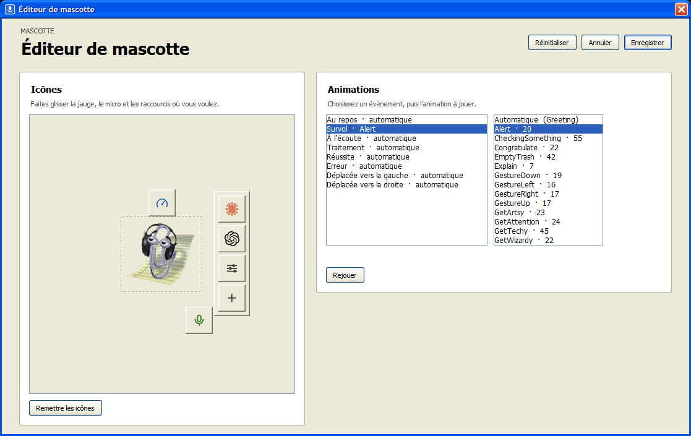
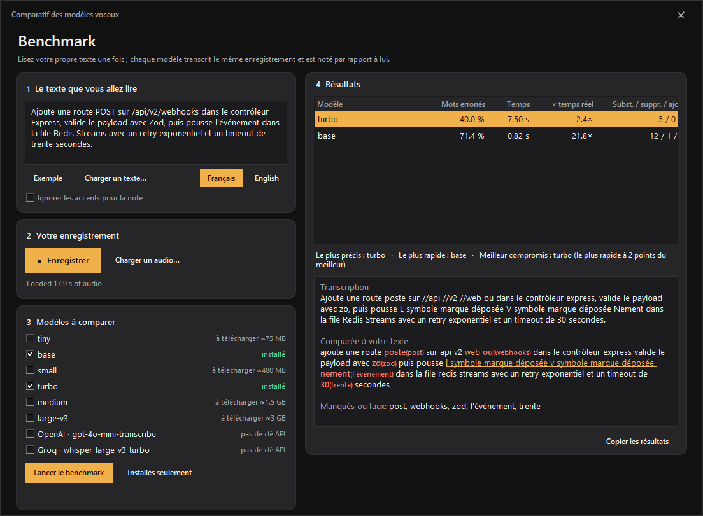

<div align="center">

# 🐶 LLM Mascot

**Une petite mascotte de bureau pour Windows qui affiche ce qu'il reste de vos quotas IA et tape ce que vous dites.**

Parlez-lui : elle transcrit sur votre PC, reformule au besoin avec Codex ou Claude, puis dépose le texte dans le champ où vous étiez. Elle n'appuie jamais sur Entrée à votre place.

[](https://github.com/NathanNT/llm-mascot/actions/workflows/ci.yml)


[](LICENSE)


[English](README.md) · **Français**


&nbsp;&nbsp;


</div>

## Ce que ça fait

- **Dictée partout.** Cliquez sur la mascotte ou appuyez sur un raccourci (**Ctrl+Alt+R** par défaut, modifiable), parlez, recliquez. Français et anglais, transcrits en local ([faster-whisper](https://github.com/SYSTRAN/faster-whisper)) ou sur votre carte graphique.
- **Inséré, jamais envoyé.** Le texte est tapé au curseur du champ qui avait le focus : ni presse-papiers, ni touche Entrée.
- **Reformulation à votre façon.** Codex ou Claude peuvent en faire un prompt clair et corrigé, le corriger, le raccourcir et plus (8 styles, ou le vôtre).
- **Consommation d'un coup d'œil.** Survolez la jauge pour vos fenêtres d'usage Codex et vos crédits.
- **Rail de raccourcis.** Claude, ChatGPT et tout ce que vous ajoutez ; survolez un logo pour ouvrir une nouvelle conversation dans l'application, VS Code, un terminal ou le navigateur.
- **Une vraie personnalité.** Chaque mascotte réagit : elle salue, écoute, réfléchit, fête une réussite, s'effondre sur une erreur. L'**éditeur de mascotte** choisit l'animation de chaque événement et déplace les icônes.
- **Trois styles :** sombre, clair chaleureux, et un **Windows XP** fidèle.
- **Privé par défaut.** L'audio reste sur votre PC, rien n'est écrit sur le disque, aucune télémétrie.

## Installation

Prérequis : Windows 10 ou 11, [Python 3.10+](https://www.python.org/downloads/), un micro.

```powershell
git clone https://github.com/NathanNT/llm-mascot.git
cd llm-mascot
.\install.bat
```

(ou téléchargez le ZIP et double-cliquez sur `install.bat`). Le script crée un environnement privé, installe les dépendances, ajoute un raccourci sur le bureau et lance la mascotte. `.\install.ps1 -Startup` la lance aussi au démarrage de Windows, `-DownloadModel` télécharge le modèle de parole tout de suite (≈150 Mo, sinon à la première dictée), `.\uninstall.ps1` supprime les raccourcis.

## Utilisation

1. **Survolez la mascotte** : elle salue et fait apparaître deux boutons ronds et le rail de raccourcis.
2. **Survolez la jauge** (au-dessus) pour la consommation, **le micro** (en dessous) pour le panneau de dictée.
3. Cliquez dans un champ de texte, cliquez sur la mascotte (ou utilisez le raccourci), parlez, recliquez. Le texte apparaît au curseur.
4. **Faites glisser** la mascotte où vous voulez, les panneaux suivent. **Clic droit** pour le menu.

<div align="center">

<br><sub>Prêt · Écoute · Traitement · Texte prêt · Erreur avec nouvel essai</sub>
</div>

## Styles

<div align="center">



<br><sub>Sombre · Clair chaleureux · Windows XP</sub>
</div>

### Windows XP

*Personnalisation → Thème → Windows XP* habille toute l'application comme le système d'origine : barres de titre Luna aux coins arrondis, fenêtres beiges, boutons radio, champs de texte blancs, curseur creux, boutons qui s'éclairent en orange sous le pointeur, blocs de progression verts, bille bleue et rouge du micro, et le rail de raccourcis dessiné comme la boîte à outils de MS Paint, dont le menu se déroule en barre d'outils.

<div align="center">

<br>

<br>

<br>

</div>

## Mascottes

<div align="center">

</div>

- **Les assistants classiques de Windows** (Clippy, Merlin, Genie, Peedy…) utilisent le format clippy.js. Ce sont des œuvres de Microsoft : elles ne sont **pas dans ce dépôt** ; téléchargez-les sur votre PC, pour votre usage : `.venv\Scripts\python tools\get_agents.py --list`, puis `... get_agents.py Clippy Merlin`.
- **Mascottes d'IA de la communauté** (Claude et Clawd, ChatGPT, la grenouille d'OpenAI et Codex, la baleine de DeepSeek, le capybara de Qwen, Doubao, Llama, le mème du Shoggoth…, 15 au total) : `python tools\get_llm_mascots.py --list` les affiche et `--all` (ou leurs noms) récupère les « pets » Codex faits par des fans depuis les galeries [awesome-codex-pet](https://github.com/legeling/awesome-codex-pet) et [Petdex](https://petdex.dev), avec auteurs, licences et sources notés dans `mascots\CREDITS.txt`. Ce ne sont pas des œuvres officielles (aucune galerie n'a encore de pet Gemini, Kimi, Mistral ou Grok) et elles ne sont jamais commitées ici.
- **Un chien original** est fourni, il marche avant tout téléchargement. **Vos propres** PNG, GIF ou WebP déposés dans `mascots/` marchent aussi, ainsi que les pets Codex déjà présents sur votre PC.
- **Éditeur de mascotte** (*Personnalisation → Modifier animations et icônes…*) : choisissez l'animation jouée au repos, au survol, à l'écoute, au traitement, en cas de réussite, d'erreur et de déplacement vers la gauche ou la droite, et faites glisser la jauge, le micro et le rail où vous voulez. Enregistré par mascotte.

<details>
<summary>Disposition de l'atlas de sprites, pour dessiner votre mascotte</summary>

Un PNG transparent de **8 colonnes × 9 lignes de cellules de 192 × 208 px** (1536 × 1872) ; les cellules inutilisées restent vides. Lignes : repos · course à droite · course à gauche · salut (survol) · saut (réussite) · échec (erreur) · attente (écoute) · libre · lecture (traitement). `python tools/make_default_mascot.py` régénère celui fourni et sert de point de départ.
</details>

## Rail de raccourcis

Appuyez sur **＋** pour ajouter un site (`https://chatgpt.com`), une application locale (`http://localhost:3000`), un programme ou un dossier ; son icône est récupérée automatiquement (jusqu'à huit). **Survolez le logo de Claude ou de ChatGPT** : une rangée de boutons ronds se déroule, un par façon de lancer une conversation installée sur votre PC (extension VS Code ou Cursor, terminal, navigateur par défaut), chacun marqué de l'icône du programme qu'il ouvre ; cliquer sur le logo lui-même ouvre l'application de bureau s'il y en a une.

## Réglages

*Personnalisation → Paramètres avancés* (captures ci-dessus) :

| Réglage | Effet |
|---|---|
| **Raccourci de dictée** | Appuyez sur une nouvelle combinaison ; refusée si un autre programme la possède déjà. |
| **Transcrire avec** | **Processeur** (privé, hors ligne), **GPU** (AMD, NVIDIA ou Intel via Vulkan), ou un service : **OpenAI**, **Groq**, ou toute adresse compatible OpenAI. Modèles de `tiny` à `large-v3` ; chacun a un bouton **Télécharger** avec une barre de progression. |
| **Vocabulaire** | Deux listes données à Whisper comme invite initiale (aussi à OpenAI et Groq) : **Mes mots** (noms de projets et de produits, de personnes, jargon ; *Apprendre depuis un dossier…* propose les noms trouvés dans un projet : noms de dossiers et de paquets, dépendances, titres du README, noms de fichiers source, jamais le code) et **Termes techniques** (mots anglais comme *commit*, *pull request*, *build*). La reformulation doit aussi rétablir les termes anglais entendus comme des sosies français. Dans un test synthétique avec une voix française, `large-v3` est passé de 3,2 % à 0 % d'erreurs sur des termes techniques anglais, et de 9,6 % à 0 % sur des phrases pleines de noms de projets (`medium` de 21 % à 4,8 %). Vérifiez sur votre voix avec la case *Utiliser mon vocabulaire* du benchmark. |
| **Transcription en direct** | Affiche les mots dans la bulle du micro pendant que vous parlez (GPU). |
| **Longues dictées** | Un enregistrement peut durer jusqu'à 30 minutes. Avec le GPU il est transcrit morceau par morceau pendant que vous parlez, le texte est donc prêt un instant après l'arrêt. |
| **Reformuler avec** | *Automatique* (Codex, sinon Claude), *Codex*, *Claude* ou *Non*. Codex reste lancé en arrière-plan, donc une reformulation prend environ 3 s ; son **mode rapide** est environ 1,5 fois plus rapide et consomme plus de crédits. |
| **Style** | **Corrigé et clair** (principal : un prompt clair et corrigé qui formule le but et ce que doit contenir la réponse), Correction, Court et simple, Étoffé, Tâche de code, Liste à puces, Ton professionnel, Ton décontracté, ou votre propre texte. |
| **Mémoriser les dernières dictées** | Envoie les 5 dernières dictées des 30 dernières minutes avec la suivante pour que la reformulation comprenne ce dont vous parlez. En mémoire seulement, désactivé par défaut. |
| **Mise en veille** | Après un délai sans utilisation (5 min à 1 h) la mascotte rétrécit et reprend sa taille quand vous la survolez ; après un délai plus long (15 min à 2 h) elle se masque dans la zone de notification (la flèche à côté de l'horloge) jusqu'à un clic sur son icône ou l'appui du raccourci. Désactivé par défaut. L'icône est toujours là, sous *Afficher les icônes cachées* : un clic ramène la mascotte, un clic droit propose *Masquer / Afficher*, *Dicter*, *Personnalisation…* et *Quitter* ; *Masquer dans la zone de notification* est aussi dans le menu clic droit de la mascotte. |
| **Lancer au démarrage · Quand le texte est prêt** | Démarrer avec Windows ; taper dans le champ ou seulement copier. |

<details>
<summary><b>Reconnaissance vocale sur le GPU</b></summary>

*Transcrire avec → GPU* lance whisper.cpp avec le backend **Vulkan**, donc AMD, NVIDIA et Intel fonctionnent. La page détecte votre carte et son pilote, puis un bouton télécharge le moteur (18 Mo, construit à partir du code public de whisper.cpp par les [GitHub Actions](.github/workflows/whisper-runtime.yml) de ce dépôt, SHA-256 fixé dans `runtime_manifest.json` et vérifié avant toute exécution) et votre modèle depuis [Hugging Face](https://huggingface.co/ggerganov/whisper.cpp) (empreinte vérifiée). Le serveur garde le modèle chargé sur le GPU, démarre et s'arrête avec l'application, et le modèle CPU prend le relais en cas de problème. Dans nos essais sur une AMD RX 6600 XT, `turbo` répondait environ deux fois plus vite que sur le processeur avec la même précision, et les dictées courtes en moins d'une seconde.
</details>

<details>
<summary><b>Transcription externe : clé d'API, pas votre compte ChatGPT</b></summary>

Les API de parole d'OpenAI et de Groq sont facturées par clé d'API ; un compte ChatGPT ou Codex ne les inclut pas et l'application ne le lit jamais pour cela. Collez une clé dans *Clé d'API* : elle est chiffrée pour votre compte Windows (DPAPI) et jamais écrite en clair dans `settings.json` (ou utilisez `OPENAI_API_KEY` / `GROQ_API_KEY`). Avec un service choisi, **l'enregistrement lui est envoyé** ; s'il est injoignable, le modèle local prend le relais.
</details>

## Comparez avec vos propres mots

Le meilleur modèle dépend de votre vocabulaire. Lisez une fois un texte que vous avez saisi, cochez les modèles, et chacun transcrit **ce même enregistrement** : vous obtenez les mots faux, le temps d'attente et exactement quels mots ont échoué, avec le plus précis, le plus rapide et le meilleur compromis désignés.

<div align="center">

</div>

Ouvrez-le depuis *Paramètres avancés → Comparer les modèles…*, ou lancez `benchmark.py --audio talk.wav --text read.txt --models base,turbo --lang fr`.

<details>
<summary><b>Fichier de configuration et service de consommation</b></summary>

Les réglages sont enregistrés dans `settings.json` (à côté de `rover.py`, jamais commité). Ceux qui ne sont pas dans l'interface :

```jsonc
{
  "insert": "type",            // "type" ou "copy" (presse-papiers seulement)
  "hotkey": "ctrl+alt+r",      // modifiable aussi dans les réglages
  "quotas_url": "",            // service local de consommation optionnel, voir ci-dessous
  "codex": { "home": "", "model": "", "reasoning": "low", "auth_store": "", "tier": "" },   // tier "priority" = mode rapide
  "claude": { "model": "" },   // "sonnet", "opus", "haiku" ou un nom complet
  "animations": {}, "layout": {}   // écrits par l'éditeur de mascotte
}
```

Le panneau de consommation lit du JSON **local** depuis `quotas_url`, au format de l'API de limites de Codex (`rateLimits.primary` / `secondary` avec `usedPercent`, `windowDurationMins`, `resetsAt`, et `credits`). Sans lui, le panneau le dit et tout le reste fonctionne. L'usage du forfait Claude n'a pas d'API locale : le panneau renvoie seulement vers [claude.ai/settings/usage](https://claude.ai/settings/usage).
</details>

## Développement

```powershell
python -m venv .venv
.venv\Scripts\pip install -r requirements-dev.txt
.venv\Scripts\python tools\dev.py test       # tests unitaires, sans écran
.venv\Scripts\python tools\dev.py restart    # relance la mascotte avec le code actuel
.venv\Scripts\python tools\dev.py check      # les vérifications de bureau de tests\gui (déplace le vrai pointeur ; arrête et relance la mascotte)
.venv\Scripts\python tools\dev.py shots      # régénère toutes les images du README (sombre, clair, Windows XP ; EN et FR)
.venv\Scripts\python tools\dev.py ci         # tests unitaires dans un environnement propre avec les seuls paquets de la CI
```

`rover.py` est l'application ; `ui_kit.py` dessine panneaux, icônes et contrôles XP avec Pillow ; `layered.py` gère les fenêtres à alpha par pixel ; `mascots.py`/`mascot_setup.py` les animations ; `voice.py`, `transcribe.py`, `accel.py`, `modelstore.py` la parole ; `core.py`, `codex_server.py`, `styles.py` la reformulation ; `i18n.py` les textes anglais d'origine et la traduction française (un test vérifie que chaque texte en a une). Voir [`CONTRIBUTING.md`](CONTRIBUTING.md).

## Dépannage

| Symptôme | Solution |
|---|---|
| « Micro indisponible » | Paramètres Windows → Confidentialité → Microphone → autoriser les applications de bureau. |
| « Modèle Whisper indisponible » | Utilisez le bouton **Télécharger** du modèle dans les réglages avancés (internet une fois). |
| Le raccourci ne fait rien | Un autre programme l'utilise : choisissez-en un autre dans les réglages avancés, ou cliquez sur la mascotte. |
| Texte tapé dans la mauvaise fenêtre | Cliquez dans le champ cible *avant* de dicter. |
| La saisie est peu fiable dans une application | Réglez *Quand le texte est prêt* sur *Copier seulement* et collez vous-même. |
| Un plantage | Lisez `rover.log` à côté de `rover.py`. |

## Confidentialité et sécurité

L'audio est traité en mémoire par un modèle local, jamais écrit sur le disque ni envoyé, sauf si vous choisissez un service externe (l'enregistrement lui est alors envoyé, et sa clé est stockée chiffrée). La reformulation optionnelle envoie le **texte transcrit** (et, si vous l'activez, les dictées récentes) à OpenAI ou à Anthropic via votre propre session Codex ou Claude. Les identifiants de vos comptes restent là où leurs outils les gardent ; l'application ne les lit jamais. Les téléchargements (moteur vocal, modèles, mascottes) n'ont lieu que si vous appuyez sur un bouton ou lancez un outil, avec vérification d'empreinte quand il y en a une.

## Licence et crédits

MIT © NathanNT, voir [`LICENSE`](LICENSE) et [`NOTICE.md`](NOTICE.md). Clippy et les autres personnages Microsoft Agent appartiennent à Microsoft et n'apparaissent dans les captures que pour montrer la compatibilité ; Windows XP est une marque de Microsoft et ce thème est un hommage, pas une ressource officielle ; les noms et logos OpenAI, ChatGPT, Codex, Claude, Qwen et DeepSeek appartiennent à leurs propriétaires. Ce projet n'est affilié à aucun d'eux.
