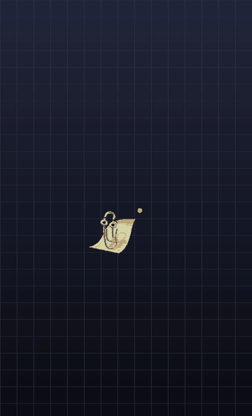
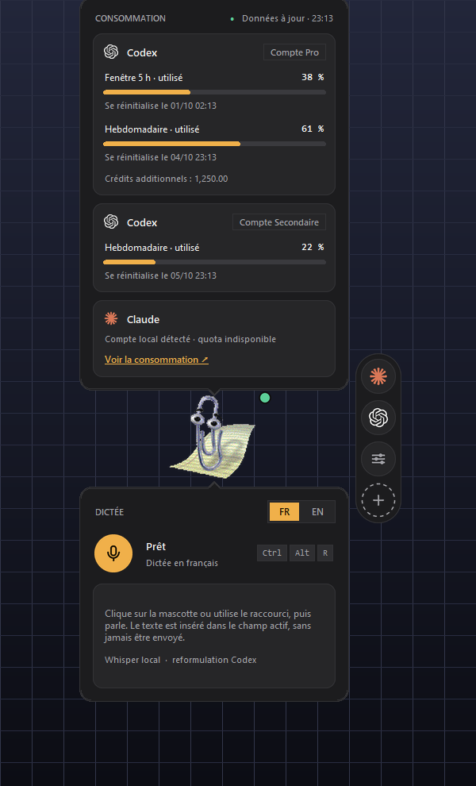
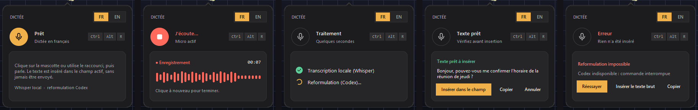
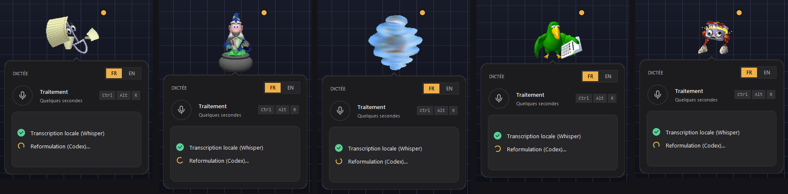
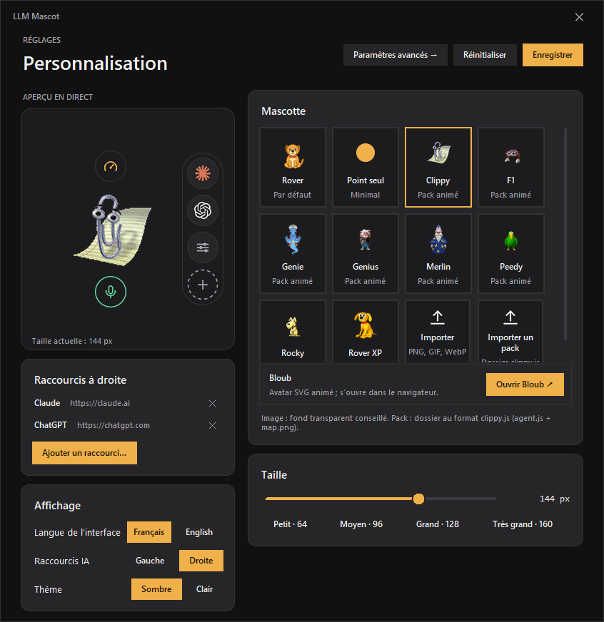
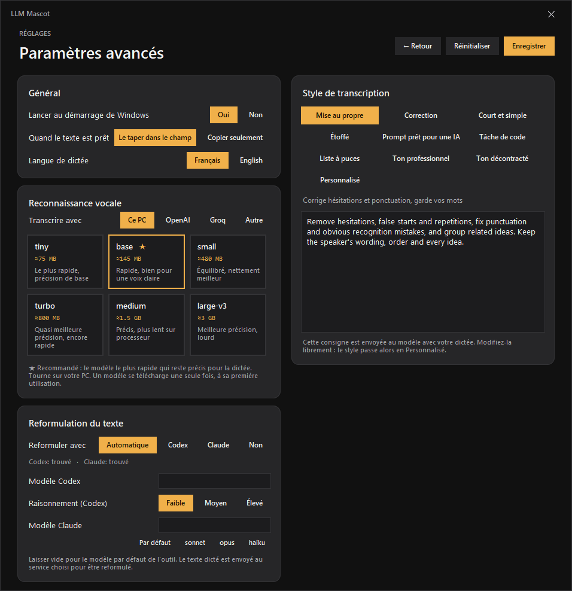
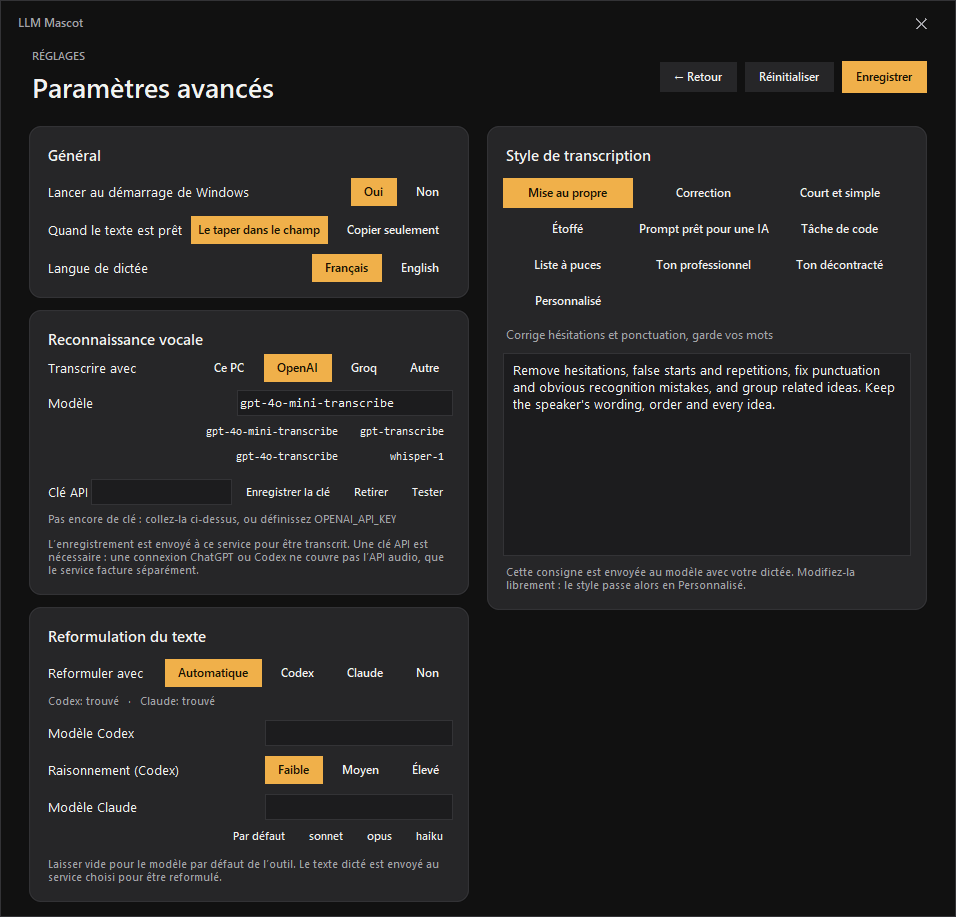

<div align="center">

# 🐶 LLM Mascot

**Une petite mascotte de bureau pour Windows qui affiche ce qu'il reste de vos quotas IA et tape ce que vous dites.**

Parlez-lui : elle transcrit sur votre PC, reformule au besoin avec Codex, puis dépose le texte dans le champ où vous étiez — sans jamais appuyer sur Entrée à votre place.

[](https://github.com/NathanNT/llm-mascot/actions/workflows/ci.yml)


[](LICENSE)


[English](README.md) · **Français**


&nbsp;&nbsp;


</div>

---

## ✨ Ce que vous obtenez

| Fonction | Détails |
|---|---|
| **Dictée partout** | Cliquez sur la mascotte ou appuyez sur **Ctrl+Alt+R**, parlez, recliquez. Français et anglais, transcription **locale** avec [faster-whisper](https://github.com/SYSTRAN/faster-whisper). |
| **Inséré, jamais envoyé** | Le texte est tapé dans le champ qui avait le focus (ni presse-papiers, ni touche Entrée). Si vous avez changé de fenêtre, un bouton permet de l'insérer plus tard. |
| **Reformulation optionnelle, à votre style** | Codex ou Claude peuvent mettre au propre, corriger, raccourcir, étoffer ou restructurer ce que vous avez dit, avec un style prédéfini ou votre propre consigne. Sans l'un ni l'autre, le texte brut est inséré. |
| **Consommation d'un coup d'œil** | Survolez la jauge : fenêtres d'usage Codex, échéances, crédits. Pour Claude, un lien vers sa page de consommation — aucun chiffre inventé. |
| **Rail de raccourcis IA** | Des boutons ronds pour Claude, ChatGPT et **tout ce que vous ajoutez** : un site, une appli web locale, un programme, un dossier. Les icônes sont récupérées automatiquement. |
| **Une vraie personnalité** | Neuf réactions par mascotte : elle salue à votre arrivée, écoute pendant que vous parlez, lit pendant qu'elle réfléchit, saute en cas de succès, s'effondre en cas d'erreur et court quand on la déplace. |
| **À votre image** | Mascotte, taille, thème (sombre / clair chaleureux), côté du rail et langue (English / Français) se règlent dans une fenêtre intégrée. |
| **Privé par conception** | L'audio ne quitte jamais votre PC, rien n'est enregistré sur disque, aucune télémétrie. |

## 🚀 Installation en une minute

**Prérequis :** Windows 10 ou 11, [Python 3.10+](https://www.python.org/downloads/) (`winget install Python.Python.3.12`), un microphone.

```powershell
git clone https://github.com/NathanNT/llm-mascot.git
cd llm-mascot
.\install.bat
```

Ou téléchargez le ZIP depuis GitHub, extrayez-le et double-cliquez sur **`install.bat`**. Le script crée un environnement privé, installe les dépendances, ajoute un raccourci sur le bureau et lance la mascotte.

| Option | Effet |
|---|---|
| `.\install.ps1 -Startup` | Lance aussi la mascotte au démarrage de Windows |
| `.\install.ps1 -DownloadModel` | Télécharge tout de suite le modèle vocal (≈150 Mo) au lieu de la première dictée |
| `.\uninstall.ps1` | Supprime les raccourcis |
| `run.bat` | Lance l'application à la main |

> Le modèle vocal se télécharge une seule fois, à la première dictée. Ensuite tout fonctionne hors ligne.

## Utilisation

1. **Survolez la mascotte** : elle salue et fait apparaître deux boutons ronds et le rail de raccourcis.
2. **Survolez la jauge** (au-dessus) pour ouvrir le panneau de **consommation**. **Survolez le micro** (en dessous) pour ouvrir le panneau de **dictée**.
3. **Cliquez dans un champ de texte**, puis cliquez sur la mascotte (ou **Ctrl+Alt+R**), parlez, recliquez.
4. Le texte apparaît au niveau du curseur, après ce que vous aviez déjà écrit. Rien n'est envoyé : vous appuyez vous-même sur Entrée. Les retours à la ligne sont tapés en Maj+Entrée.
5. **Déplacez** la mascotte où vous voulez ; les panneaux la suivent. **Clic droit** pour le menu.

<div align="center">

<br><sub>Prêt · Écoute (niveau du micro en direct) · Traitement · Texte prêt à insérer · Erreur avec nouvel essai</sub>
</div>

## 🎭 Mascottes

<div align="center">

</div>

Les assistants animés classiques de Windows fonctionnent directement, avec des dizaines d'animations chacun. Les voici au travail pendant que l'application transcrit et reformule une dictée :

<div align="center">

</div>

- **Clippy, Merlin, Genie, Rocky, Peedy, F1, Genius, Rover XP…** utilisent le format clippy.js. Ce sont des créations de Microsoft : elles ne sont **pas incluses** dans ce dépôt ; téléchargez-les sur votre machine, pour votre usage personnel, avec :
  ```powershell
  .venv\Scripts\python tools\get_agents.py --list
  .venv\Scripts\python tools\get_agents.py Clippy Merlin Genie
  ```
  Elles reçoivent les mêmes événements que toutes les mascottes (salutation, écoute, traitement, félicitations, alerte…) et jouent leurs animations de repos au hasard.
- **Une mascotte de secours** : un petit chien original (neuf réactions), pour que l'application fonctionne avant tout téléchargement.
- **Vos propres images** : PNG, GIF ou WebP déposés dans `mascots/` (ou importés depuis la fenêtre de réglages). Un PNG de 1536 × 1872 organisé comme l'atlas ci-dessous joue les neuf réactions.
- **Mascottes Codex** : si l'extension Codex est installée, ses mascottes apparaissent toutes seules dans les réglages (lues sur place, jamais copiées).

<details>
<summary><b>Format de l'atlas</b> (pour créer votre mascotte)</summary>

Un atlas est un PNG transparent de **8 colonnes × 9 lignes de cellules de 192 × 208 px** (1536 × 1872). Les cellules inutilisées restent vides.

| Ligne | Animation | Images | Jouée quand |
|---|---|---|---|
| 0 | repos | 6 | au repos (boucle) |
| 1 | course à droite | 8 | déplacement vers la droite |
| 2 | course à gauche | 8 | déplacement vers la gauche |
| 3 | salut | 4 | on survole la mascotte |
| 4 | saut | 5 | texte prêt ou inséré |
| 5 | échec | 8 | une erreur est survenue |
| 6 | attente | 6 | écoute (boucle) |
| 7 | flair | 6 | animation de réserve |
| 8 | lecture | 6 | traitement (boucle) |

`python tools/make_default_mascot.py` régénère l'atlas fourni et sert de point de départ.
</details>

## Rail de raccourcis

Le rail sur le côté de la mascotte ouvre vos outils IA en un clic. Appuyez sur **＋** (ou *Personnalisation → Raccourcis*) puis saisissez :

- un site : `https://chatgpt.com`
- une appli web locale : `http://localhost:3000`
- un programme ou un raccourci : `C:\Program Files\App\app.exe`, un `.lnk`, un dossier

L'icône est le favicon du site ou l'icône Windows du fichier. Clic droit sur un bouton pour l'ouvrir ou le retirer. Huit raccourcis au maximum.

<div align="center">

</div>

<div align="center">
Sombre par défaut, avec un thème clair chaleureux :<br>

</div>

## Paramètres avancés

*Personnalisation → Paramètres avancés* regroupe les options qui changent le comportement de la dictée.

<div align="center">

</div>

| Réglage | Effet |
|---|---|
| **Lancer au démarrage de Windows** | Démarre la mascotte à l'ouverture de votre session (une entrée par utilisateur, sans droits administrateur). Appliqué en appuyant sur *Enregistrer*. |
| **Quand le texte est prêt** | *Le taper dans le champ* (par défaut) ou *Copier seulement* dans le presse-papiers. |
| **Transcrire avec** | *Ce PC* (par défaut, privé, hors ligne) ou un service externe : **OpenAI** (`gpt-4o-mini-transcribe`, le rapide et économique), **Groq** (`whisper-large-v3-turbo`, très rapide, offre gratuite) ou **Autre** (toute adresse compatible OpenAI). Si le service est injoignable ou sans crédit, le modèle local prend le relais quand il est installé. |
| **Modèle vocal** (Ce PC) | `tiny` (≈75 Mo) à `large-v3` (≈3 Go). **`base` (★) est le meilleur compromis vitesse/précision** pour la dictée ; il se charge en arrière-plan au démarrage pour que la première dictée réponde tout de suite. Un modèle se télécharge une seule fois, à sa première utilisation. |
| **Reformuler avec** | *Automatique* (Codex s'il est disponible, sinon Claude), *Codex*, *Claude*, ou *Non* pour toujours insérer la transcription brute. |
| **Modèle Codex / Claude** | Le modèle utilisé par chaque outil. Vide = le modèle par défaut de l'outil ; pour Claude, vous pouvez saisir un alias comme `sonnet`, `opus` ou `haiku`, ou un nom complet. |
| **Style de transcription** | La consigne d'édition envoyée avec votre dictée. Choisissez un style prédéfini ou écrivez le vôtre. |

Les styles : **Mise au propre** (hésitations et ponctuation, vos propres mots), **Correction** (orthographe et syntaxe seulement, rien d'autre ne change), **Court et simple**, **Étoffé** (explicite l'implicite, n'invente rien), **Prompt prêt pour une IA**, **Tâche de code**, **Liste à puces**, **Ton professionnel**, **Ton décontracté** et **Personnalisé**. Modifiez le texte d'un style prédéfini et il devient *Personnalisé*.

<div align="center">

</div>

#### Un transcripteur externe : une clé API, pas votre connexion ChatGPT

Les API vocales d'OpenAI et de Groq sont facturées ou limitées **par clé API**. Une connexion ChatGPT ou Codex ne les inclut pas : impossible donc de dépenser les crédits de votre abonnement pour transcrire, et l'application ne lit pas votre connexion ChatGPT/Codex pour cela. Créez une clé sur le site du fournisseur, collez-la dans *Clé API* et appuyez sur *Enregistrer la clé* : elle est chiffrée pour votre compte Windows (DPAPI) et jamais écrite en clair dans `settings.json`. Vous pouvez aussi définir la variable d'environnement `OPENAI_API_KEY` / `GROQ_API_KEY`. *Tester* vérifie la clé sans rien dépenser. Quand vous choisissez un service, **l'enregistrement lui est envoyé**.

Pour la vitesse, gardez les valeurs par défaut : `gpt-4o-mini-transcribe` (OpenAI) ou `whisper-large-v3-turbo` (Groq) sont les modèles petits et rapides, et la dictée est une tâche facile pour eux. Le modèle local `base` est l'alternative privée.

#### Pourquoi les styles « Prompt prêt pour une IA » et « Tâche de code » ont cette forme

Ils suivent ce sur quoi les guides de prompt d'Anthropic et d'OpenAI s'accordent : être clair et direct, mettre la tâche en premier, ajouter le contexte et la raison, lister des exigences concrètes, dire quoi faire plutôt que quoi éviter, préciser le format de sortie, garder noms et identifiants exacts, ne rien ajouter pour meubler. Les styles transforment une dictée décousue en cette forme sans rien inventer. Sources : [bonnes pratiques de prompt de Claude](https://platform.claude.com/docs/en/build-with-claude/prompt-engineering/claude-prompting-best-practices) et [prompt engineering d'OpenAI](https://developers.openai.com/api/docs/guides/prompt-engineering).

Claude est utilisé via [Claude Code](https://docs.claude.com/en/docs/claude-code) en mode impression, avec tous les outils désactivés et sans session enregistrée : il ne fait que reformuler du texte.

## Configuration

Tout ce que vous changez dans la fenêtre de réglages est enregistré dans `settings.json` (à côté de `rover.py`, jamais versionné). Quelques options avancées n'existent que dans le fichier :

```jsonc
{
  "ui_language": "auto",        // "auto" suit Windows, ou "en" / "fr"
  "language": "fr",             // langue de dictée : "en" ou "fr" (aussi le sélecteur FR/EN du panneau)
  "insert": "type",             // "type" tape au niveau du curseur ; "copy" met seulement le texte dans le presse-papiers (Ctrl+V)
  "whisper_model": "base",      // modèle local : "tiny", "base", "small", "turbo", "medium", "large-v3"
  "transcription": {
    "engine": "local",          // "local", "openai", "groq" ou "custom"
    "model": "",                // vide = le modèle rapide par défaut du service
    "base_url": "",             // "custom" seulement : une adresse compatible OpenAI, https (http seulement pour localhost)
    "api_key": ""               // écrite par l'application, chiffrée ; une variable d'environnement convient aussi
  },
  "quotas_url": "",             // service de consommation optionnel, voir plus bas
  "rewrite_provider": "auto",   // "auto", "codex", "claude" ou "off" (insère la transcription brute)
  "rewrite_style": "faithful",  // l'identifiant d'un style, ou "custom" pour utiliser "rewrite_prompt"
  "rewrite_prompt": "",
  "claude": { "model": "" },    // vide = modèle par défaut ; "sonnet", "opus", "haiku" ou un nom complet
  "codex": {
    "home": "",                 // dossier du profil Codex, par défaut %CODEX_HOME% ou ~/.codex
    "model": "",                // vide = modèle par défaut de Codex
    "reasoning": "low",         // minimal | low | medium | high
    "auth_store": ""            // "", "file", "keyring" ou "auto"
  }
}
```

### Reformulation Codex (optionnelle)

Si le [CLI Codex](https://github.com/openai/codex) est dans le `PATH` et connecté, la mascotte envoie la transcription à `codex exec` dans un bac à sable en lecture seule, sans outils, uniquement pour corriger hésitations et ponctuation. Chaque reformulation consomme un peu de quota Codex. Choisissez *Non* sous *Reformuler avec* (ou `"rewrite_provider": "off"`) pour l'éviter.

### Panneau de consommation (optionnel)

Le panneau lit un JSON **local** à l'adresse `quotas_url`, que n'importe quel petit service de votre cru peut fournir. Il comprend la forme renvoyée par l'API de limites de Codex :

```jsonc
{ "now": 1790000000,
  "accounts": [{ "name": "Compte 1",
    "metrics": { "last_success_at": 1789999990,
      "limits": { "rateLimits": {
        "planType": "pro",
        "primary":   { "usedPercent": 38, "windowDurationMins": 300,   "resetsAt": 1790010000 },
        "secondary": { "usedPercent": 61, "windowDurationMins": 10080, "resetsAt": 1790400000 },
        "credits":   { "hasCredits": true, "balance": "1250" } } } } }] }
```

Sans `quotas_url`, le panneau l'indique et le reste de l'application fonctionne normalement. La consommation de l'abonnement Claude n'est exposée par aucune API locale : le panneau propose seulement un lien vers [claude.ai/settings/usage](https://claude.ai/settings/usage) quand une installation locale de Claude est détectée.

## Architecture

```
rover.py        l'application : fenêtres, survol, dictée, fenêtre de réglages
ui_kit.py       panneaux, icônes et tracés SVG lissés dessinés avec Pillow (aucune image d'interface)
layered.py      fenêtres à transparence par pixel (UpdateLayeredWindow) : bords nets, vrais fondus
mascots.py      atlas de sprites, packs clippy.js, GIF – et lien événement → animation
voice.py        capture du micro et transcription faster-whisper
core.py         reformulation Codex optionnelle et lecture de la consommation
settings.py     préférences, liste de raccourcis, découverte des mascottes
windows.py      raccourci clavier, suivi du focus, insertion du texte (SendInput), multi-écran
i18n.py         textes sources en anglais + traduction française
tools/          aides d'installation, générateurs d'assets, rendu des captures
tests/unit      tests sans affichage (lancés en CI)     tests/gui   vérifications sur un vrai bureau
```

## Développement

```powershell
python -m venv .venv
.venv\Scripts\pip install -r requirements-dev.txt
.venv\Scripts\python -m pytest -q tests            # tests unitaires, sans affichage
.venv\Scripts\python tests\gui\check_drag.py       # déplacement et survol sur un vrai bureau
.venv\Scripts\python tests\gui\check_animation.py  # animations, packs et raccourcis
.venv\Scripts\python tools\make_screenshots.py --lang fr --theme dark --out docs\img\fr --gif
```

Ajouter une langue : traduisez les textes dans `i18n.py` (un test vérifie que chaque `tr("…")` a sa traduction).

## Dépannage

| Symptôme | Solution |
|---|---|
| *« Microphone indisponible »* | Paramètres Windows → Confidentialité → Microphone → autoriser les applications de bureau. |
| *« Modèle Whisper indisponible »* | La première dictée a besoin d'internet pour récupérer le modèle ; lancez `install.ps1 -DownloadModel` en ligne. |
| Ctrl+Alt+R ne fait rien | Une autre application possède ce raccourci ; cliquez sur la mascotte. |
| Le texte part dans la mauvaise fenêtre | Cliquez dans le champ voulu *avant* de dicter ; la mascotte retient la dernière fenêtre utilisée. |
| La saisie est peu fiable dans une application | Mettez `"insert": "copy"` : le texte va dans le presse-papiers et vous le collez vous-même. Le panneau a aussi un bouton **Copier** et le menu du clic droit propose *Copier le dernier texte*. |
| « La clé API a été refusée » | Vérifiez la clé sur le site du fournisseur ; les abonnements ChatGPT ne fonctionnent pas ici (voir plus haut). Utilisez *Tester* dans les paramètres avancés. |
| Une partie de mon brouillon a été remplacée | Le texte est tapé au niveau du curseur : un passage *sélectionné* est remplacé, comme avec n'importe quelle saisie. La mascotte ne prend jamais le focus du clavier quand on clique dessus, donc votre curseur et votre brouillon restent intacts. |
| Un plantage | Consultez `rover.log` à côté de `rover.py`. |

## Confidentialité et sécurité

- Par défaut, l'audio est traité en mémoire par un modèle local et n'est jamais écrit sur disque ni envoyé. Seul le choix d'un service de transcription externe lui envoie l'enregistrement, et la clé API est alors stockée chiffrée pour votre compte Windows.
- Les prompts ne sont pas conservés. La reformulation Codex optionnelle envoie le **texte transcrit** à OpenAI via votre propre session Codex, comme n'importe quel prompt Codex.
- Les identifiants de vos comptes restent à leur place habituelle ; l'application ne les lit jamais.
- Les icônes des raccourcis ne sont récupérées qu'aux adresses que vous ajoutez.

## Licence et crédits

MIT © NathanNT. Voir [`LICENSE`](LICENSE) et [`NOTICE.md`](NOTICE.md).

Clippy et les autres personnages Microsoft Agent appartiennent à Microsoft et n'apparaissent dans les captures que pour montrer la compatibilité ; les noms et logos d'OpenAI, ChatGPT, Codex et Claude appartiennent à leurs propriétaires et servent à identifier les raccourcis. Ce projet n'est affilié à aucun d'eux.
