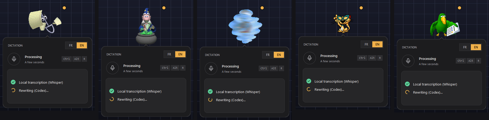
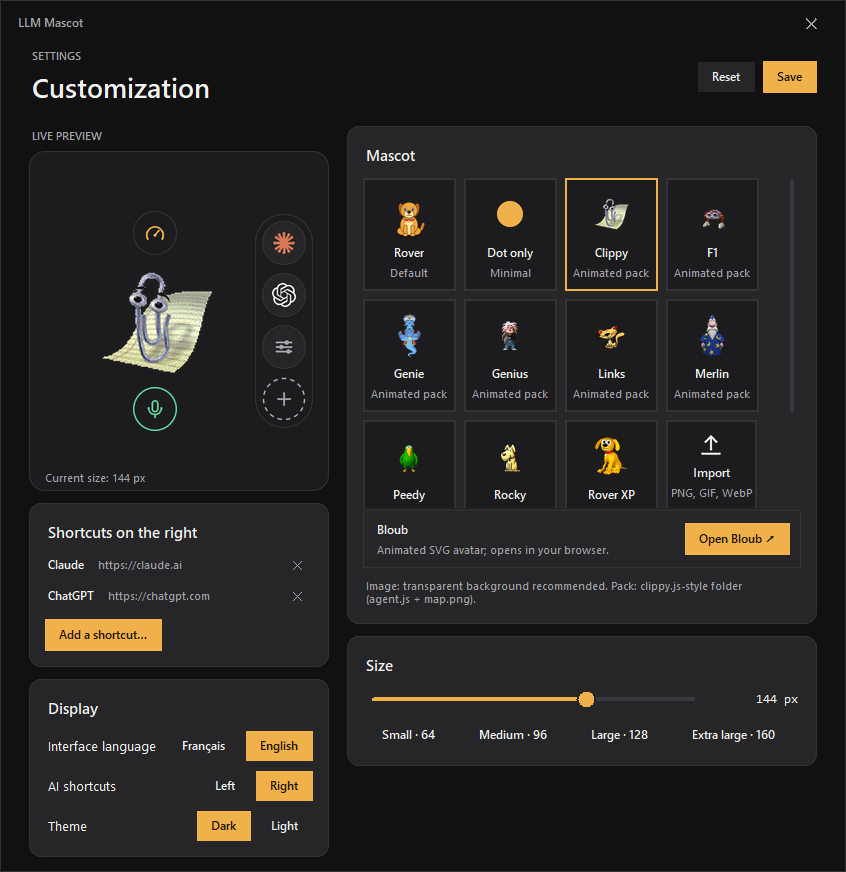

<div align="center">

# 🐶 LLM Mascot

**A tiny desktop companion for Windows that shows how much of your AI quota is left and types what you say.**

Talk to it, it transcribes on your PC, optionally polishes the text with Codex, and drops the result into the field you were typing in — never pressing Enter for you.

[](https://github.com/NathanNT/llm-mascot/actions/workflows/ci.yml)


[](LICENSE)


**English** · [Français](README.fr.md)


&nbsp;&nbsp;


</div>

---

## ✨ What you get

| Feature | Details |
|---|---|
| **Dictation anywhere** | Click the mascot or press **Ctrl+Alt+R**, speak, click again. French and English, transcribed **locally** with [faster-whisper](https://github.com/SYSTRAN/faster-whisper). |
| **Inserted, never sent** | The text is typed into the field that had focus (no clipboard, no Enter key). If you switched windows, a button lets you insert it later. |
| **Optional Codex polish** | With the Codex CLI signed in, the raw transcript is rewritten into a clean prompt. Without it, the raw text is inserted. |
| **Usage at a glance** | Hover the gauge to see Codex usage windows, reset times and credits. Claude shows a one-click link to its usage page — no invented numbers. |
| **AI shortcut rail** | Round buttons for Claude, ChatGPT and **anything you add**: a website, a local web app, a program, a folder. Icons are fetched automatically. |
| **Real personality** | Nine reactions per mascot: it waves when you arrive, listens while you talk, reads while it thinks, jumps on success, collapses on errors, runs while you drag it. |
| **Make it yours** | Change mascot, size, theme (dark / warm light), side of the rail and language (English / Français) from a built-in settings window. |
| **Private by design** | Audio never leaves your PC, nothing is stored on disk, no telemetry. |

## 🚀 Install in one minute

**Requirements:** Windows 10 or 11, [Python 3.10+](https://www.python.org/downloads/) (`winget install Python.Python.3.12`), a microphone.

```powershell
git clone https://github.com/NathanNT/llm-mascot.git
cd llm-mascot
.\install.bat
```

Or download the ZIP from GitHub, extract it and double-click **`install.bat`**. It creates a private environment, installs the dependencies, adds a desktop shortcut and starts the mascot.

| Option | What it does |
|---|---|
| `.\install.ps1 -Startup` | Also start the mascot when Windows starts |
| `.\install.ps1 -DownloadModel` | Download the speech model now (≈150 MB) instead of at the first dictation |
| `.\uninstall.ps1` | Remove the shortcuts |
| `run.bat` | Start it by hand |

> The speech model is downloaded once, the first time you dictate. After that everything works offline.

## How to use it

1. **Hover the mascot** – it waves and reveals two round buttons and the shortcut rail.
2. **Hover the gauge** (above) to open the **usage** panel. **Hover the microphone** (below) to open the **dictation** panel.
3. **Click in any text field**, then click the mascot (or press **Ctrl+Alt+R**), speak, and click again.
4. The text appears in the field. Nothing is sent: you press Enter yourself.
5. **Drag** the mascot anywhere; every panel follows it. **Right-click** for the menu.

<div align="center">

<br><sub>Ready · Listening (live microphone level) · Processing · Text ready to insert · Error with retry</sub>
</div>

## 🎭 Mascots

<div align="center">

</div>

The classic animated Windows assistants work out of the box, each with dozens of animations. Here they are at work while the app transcribes and rewrites a dictation:

<div align="center">

</div>

- **Clippy, Merlin, Genie, Links, Rocky, Peedy, F1, Genius, Rover XP…** use the clippy.js format. They are Microsoft's artwork, so they are **not included** in this repository; download them onto your own machine, for your own use, with:
  ```powershell
  .venv\Scripts\python tools\get_agents.py --list
  .venv\Scripts\python tools\get_agents.py Clippy Merlin Genie
  ```
  They receive the same events as every mascot (greeting, listening, processing, congratulation, alert…) and play their idle animations at random.
- **A bundled fallback** – a simple original dog (nine reactions) so the app works before you download anything.
- **Your own images** – PNG, GIF or WebP dropped in `mascots/` (or imported from the settings window). A 1536 × 1872 PNG laid out like the atlas below plays all nine reactions.
- **Codex pets** – if the Codex extension is installed, its pets appear automatically in the settings window (they are read in place, never copied).

<details>
<summary><b>Sprite atlas layout</b> (for creating your own mascot)</summary>

An atlas is a transparent PNG of **8 columns × 9 rows of 192 × 208 px cells** (1536 × 1872). Unused cells stay empty.

| Row | Clip | Frames | Played when |
|---|---|---|---|
| 0 | idle | 6 | resting (loops) |
| 1 | run right | 8 | dragging to the right |
| 2 | run left | 8 | dragging to the left |
| 3 | wave | 4 | you hover the mascot |
| 4 | jump | 5 | text is ready or inserted |
| 5 | fail | 8 | an error occurred |
| 6 | wait | 6 | listening (loops) |
| 7 | sniff | 6 | spare clip |
| 8 | read | 6 | processing (loops) |

`python tools/make_default_mascot.py` regenerates the bundled atlas and is a good starting point.
</details>

## Shortcut rail

The rail on the side of the mascot opens your AI tools in one click. Press **＋** (or use *Customize → Shortcuts*) and enter:

- a website: `https://chatgpt.com`
- a local web app: `http://localhost:3000`
- a program or shortcut: `C:\Program Files\App\app.exe`, a `.lnk`, a folder

The icon is the site's favicon or the file's Windows icon. Right-click a button to open or remove it. Up to eight shortcuts.

<div align="center">

</div>

<div align="center">
Dark by default, with a warm light theme:<br>

</div>

## Configuration

Everything you change in the settings window is saved to `settings.json` (next to `rover.py`, never committed). A few advanced options are only in the file:

```jsonc
{
  "ui_language": "auto",        // "auto" follows Windows, or "en" / "fr"
  "language": "en",             // dictation language: "en" or "fr" (also the FR/EN switch in the panel)
  "whisper_model": "base",      // "tiny", "base", "small", "medium"… bigger = more accurate, slower
  "quotas_url": "",             // optional usage service, see below
  "codex": {
    "rewrite": "auto",          // "auto" uses Codex when available, "off" always inserts the raw transcript
    "home": "",                 // Codex profile folder, default %CODEX_HOME% or ~/.codex
    "model": "",                // empty = Codex default
    "reasoning": "low",         // minimal | low | medium | high
    "auth_store": ""            // "", "file", "keyring" or "auto"
  }
}
```

### Codex rewrite (optional)

If the [Codex CLI](https://github.com/openai/codex) is on your `PATH` and signed in, Rover pipes the transcript through `codex exec` in a read-only sandbox with tools disabled, only to fix hesitations and punctuation. Each rewrite uses a little of your Codex quota. Set `"rewrite": "off"` to skip it.

### Usage panel (optional)

The panel reads **local** JSON from `quotas_url`, which any small service of yours can provide. It understands the shape returned by Codex's rate-limit API:

```jsonc
{ "now": 1790000000,
  "accounts": [{ "name": "Account 1",
    "metrics": { "last_success_at": 1789999990,
      "limits": { "rateLimits": {
        "planType": "pro",
        "primary":   { "usedPercent": 38, "windowDurationMins": 300,   "resetsAt": 1790010000 },
        "secondary": { "usedPercent": 61, "windowDurationMins": 10080, "resetsAt": 1790400000 },
        "credits":   { "hasCredits": true, "balance": "1250" } } } } }] }
```

Without `quotas_url` the panel says so and the rest of the app works normally. Claude's plan usage is not exposed by any local API, so the panel only links to [claude.ai/settings/usage](https://claude.ai/settings/usage) when a local Claude install is detected.

## How it is built

```
rover.py        the application: windows, hover logic, dictation flow, settings window
ui_kit.py       anti-aliased panels, icons and SVG paths drawn with Pillow (no image assets for UI)
layered.py      per-pixel-alpha windows (UpdateLayeredWindow): clean edges, real fades
mascots.py      sprite atlases, clippy.js character packs, GIFs – and the event → animation mapping
voice.py        microphone capture and faster-whisper transcription
core.py         optional Codex rewrite and usage reading
settings.py     preferences, shortcut list, mascot discovery
windows.py      hotkey, focus tracking, text insertion (SendInput), multi-monitor placement
i18n.py         English source strings + French translation
tools/          install helpers, asset generators, screenshot renderer
tests/unit      headless tests (run in CI)        tests/gui   checks that need a real desktop
```

Design notes: windows are borderless top-levels; buttons and the rail are true per-pixel-alpha layered windows, bubbles use a colour key with crisp edges so Tk widgets can live inside them.

## Development

```powershell
python -m venv .venv
.venv\Scripts\pip install -r requirements-dev.txt
.venv\Scripts\python -m pytest -q tests            # unit tests, no display needed
.venv\Scripts\python tests\gui\check_drag.py       # drag/hover checks on a real desktop
.venv\Scripts\python tests\gui\check_animation.py  # animations, packs and shortcuts
.venv\Scripts\python tools\make_screenshots.py --lang en --theme dark --out docs\img\en --gif
```

Adding a language: translate the strings in `i18n.py` (a unit test checks that every `tr("…")` string has a translation).

## Troubleshooting

| Symptom | Fix |
|---|---|
| *"Microphone unavailable"* | Windows Settings → Privacy → Microphone → allow desktop apps. |
| *"Whisper model unavailable"* | The first dictation needs internet to fetch the model; run `install.ps1 -DownloadModel` while online. |
| Ctrl+Alt+R does nothing | Another app owns the shortcut; click the mascot instead. |
| The text is typed in the wrong window | Click in the target field *before* dictating; the mascot remembers the last window you used. |
| Something crashed | Look at `rover.log` next to `rover.py`. |

## Privacy & security

- Audio is processed in memory by a local model and is never written to disk or uploaded.
- Prompts are not stored. The optional Codex rewrite sends the **transcript text** to OpenAI through your own Codex session, like any Codex prompt.
- Account credentials stay in their usual places; the app never reads them.
- Shortcut icons are fetched only from the addresses you add.

## License and credits

MIT © NathanNT. See [`LICENSE`](LICENSE) and [`NOTICE.md`](NOTICE.md).

Clippy and the other Microsoft Agent characters are the property of Microsoft and appear in screenshots only to show compatibility; OpenAI, ChatGPT, Codex and Claude names and logos belong to their owners and are used to label shortcuts. This project is not affiliated with any of them.
