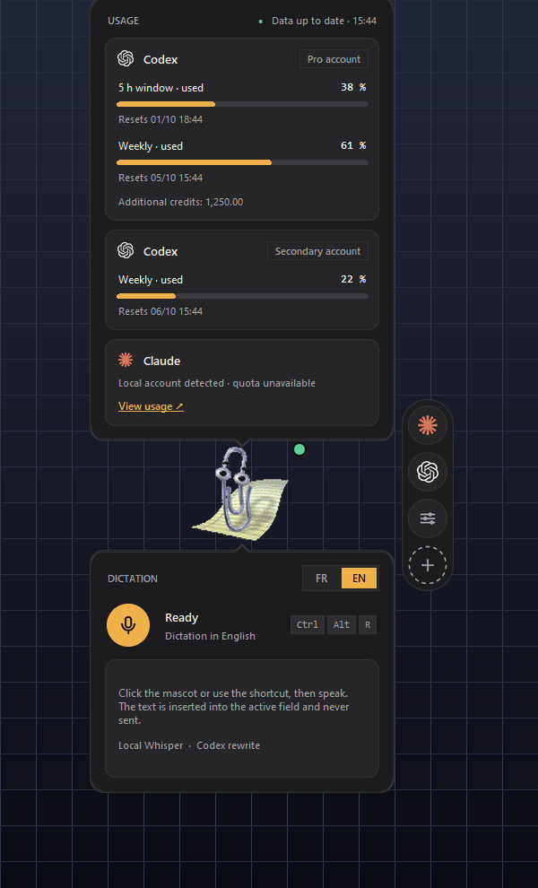
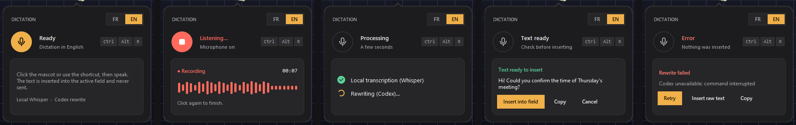
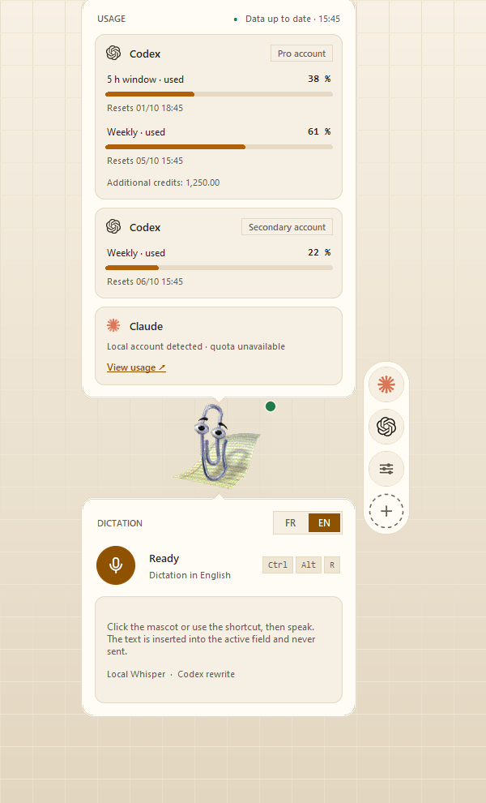
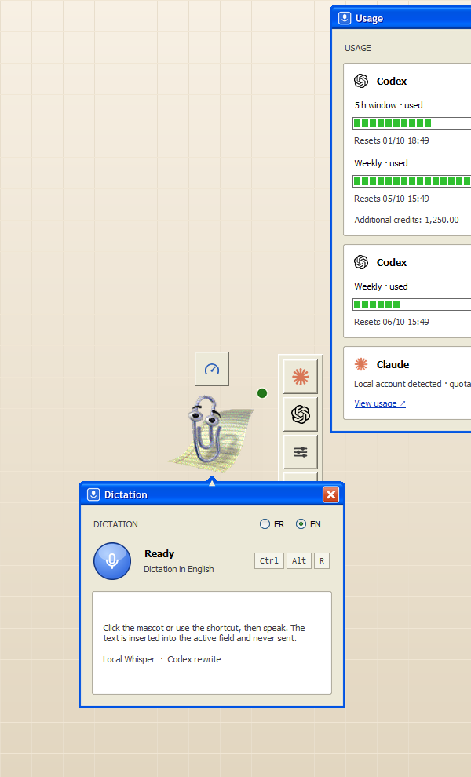
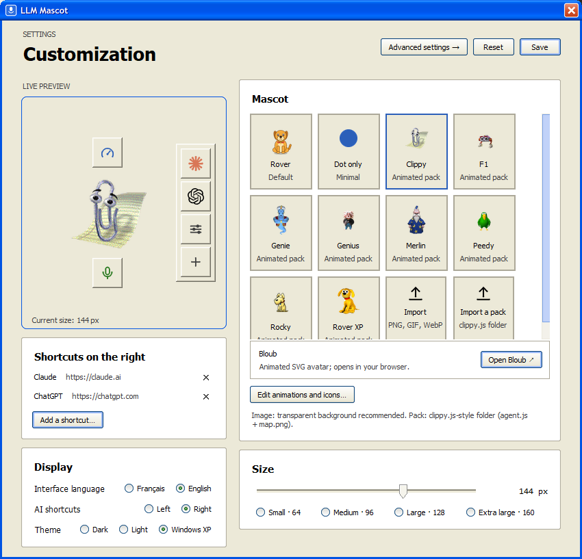
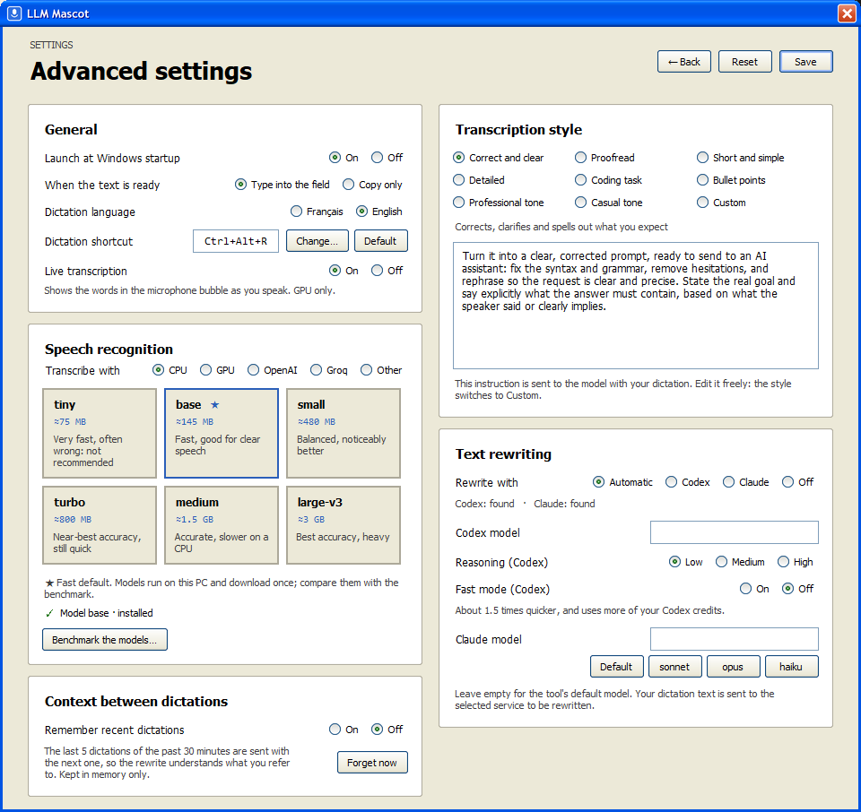
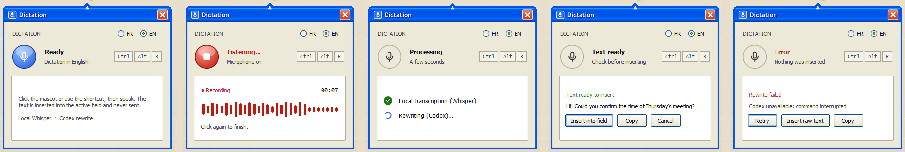
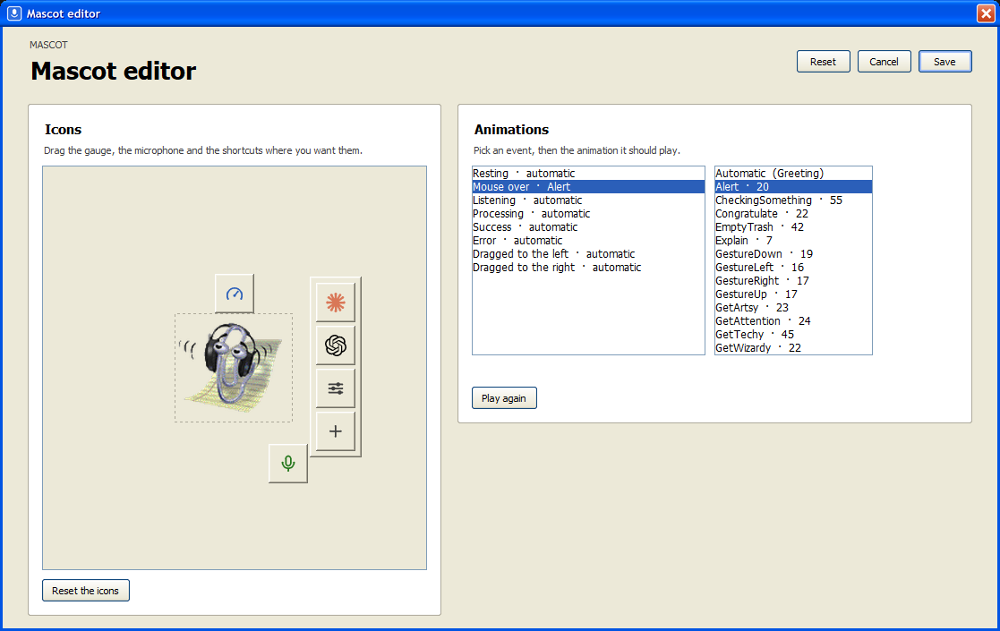
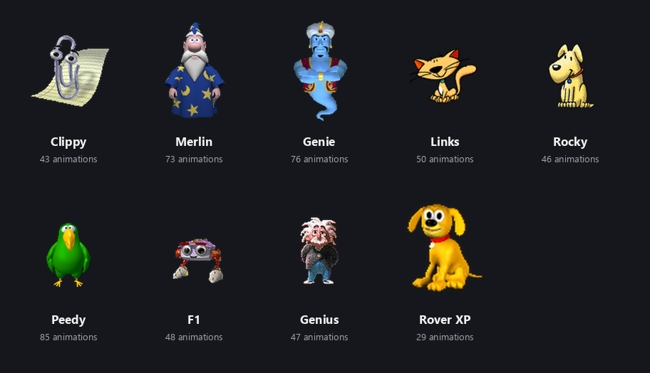
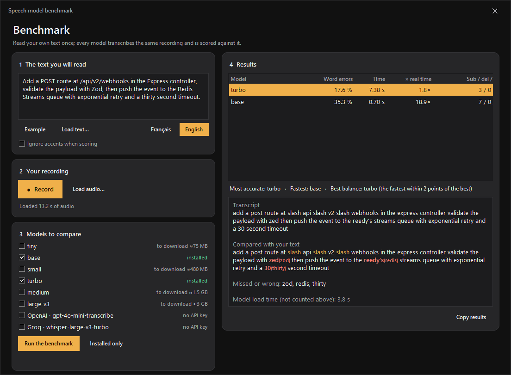

<div align="center">

# 🐶 LLM Mascot

**A small desktop companion for Windows that shows what is left of your AI quota and types what you say.**

Talk to it: it transcribes on your PC, optionally polishes the text with Codex or Claude, and drops the result into the field you were typing in. It never presses Enter for you.

[](https://github.com/NathanNT/llm-mascot/actions/workflows/ci.yml)


[](LICENSE)


**English** · [Français](README.fr.md)


&nbsp;&nbsp;


</div>

## What it does

- **Dictation anywhere.** Click the mascot or press a shortcut (**Ctrl+Alt+R** by default, changeable), speak, click again. French and English, transcribed locally ([faster-whisper](https://github.com/SYSTRAN/faster-whisper)) or on your graphics card.
- **Inserted, never sent.** The text is typed at the caret of the field that had focus: no clipboard, no Enter key.
- **Rewrite in your style.** Codex or Claude can turn the dictation into a clear, corrected prompt, proofread it, shorten it and more (8 styles, or your own).
- **Usage at a glance.** Hover the gauge for your Codex usage windows and credits.
- **Shortcut rail.** Claude, ChatGPT and anything you add; hover a logo to open a new chat in the desktop app, VS Code, a terminal or the browser.
- **A real personality.** Each mascot reacts: waves, listens, thinks, celebrates, collapses on errors. The **mascot editor** lets you pick the animation for each event and move the icons.
- **Three looks:** dark, warm light, and a faithful **Windows XP**.
- **Private by default.** Audio stays on your PC, nothing is written to disk, no telemetry.

## Install

Requirements: Windows 10 or 11, [Python 3.10+](https://www.python.org/downloads/), a microphone.

```powershell
git clone https://github.com/NathanNT/llm-mascot.git
cd llm-mascot
.\install.bat
```

(or download the ZIP and double-click `install.bat`). It creates a private environment, installs the dependencies, adds a desktop shortcut and starts the mascot. `.\install.ps1 -Startup` also starts it with Windows, `-DownloadModel` fetches the speech model now (≈150 MB, otherwise at the first dictation), `.\uninstall.ps1` removes the shortcuts.

## Use it

1. **Hover the mascot**: it waves and shows two round buttons and the shortcut rail.
2. **Hover the gauge** (above) for usage, **the microphone** (below) for the dictation panel.
3. Click in any text field, click the mascot (or press the shortcut), speak, click again. The text appears at the caret.
4. **Drag** the mascot anywhere, panels follow. **Right-click** for the menu.

<div align="center">

<br><sub>Ready · Listening · Processing · Text ready · Error with retry</sub>
</div>

## Looks

<div align="center">



<br><sub>Dark · Warm light · Windows XP</sub>
</div>

### Windows XP

*Customize → Theme → Windows XP* dresses the whole app like the original system: Luna title bars with rounded corners, beige windows, radio buttons, white text boxes, the sunken trackbar, push buttons that glow orange under the pointer, green progress blocks, the glossy blue and red microphone orb, and the shortcut rail drawn as the MS Paint toolbox, with its menu unrolling as a toolbar.

<div align="center">

<br>

<br>

<br>

</div>

## Mascots

<div align="center">

</div>

- **Classic Windows assistants** (Clippy, Merlin, Genie, Peedy…) use the clippy.js format. They are Microsoft's artwork, so they are **not in this repository**; download them onto your own PC for your own use: `.venv\Scripts\python tools\get_agents.py --list`, then `... get_agents.py Clippy Merlin`.
- **AI mascots from the community** (a Claude, a DeepSeek whale, a capybara for Qwen's mascot): `tools\get_llm_mascots.py` fetches fan-made Codex "pets" on request, with their authors and licences written to `mascots\CREDITS.txt`. They are not official artwork and are never committed here.
- **A bundled original dog** works before you download anything. **Your own** PNG, GIF or WebP dropped in `mascots/` works too, and so do Codex pets already on your PC.
- **Mascot editor** (*Customize → Edit animations and icons…*): choose which animation plays for resting, hover, listening, processing, success, error and dragging left or right, and drag the gauge, the microphone and the shortcut rail where you like. Saved per mascot.

<details>
<summary>Sprite atlas layout, to draw your own mascot</summary>

A transparent PNG of **8 columns × 9 rows of 192 × 208 px cells** (1536 × 1872); unused cells stay empty. Rows: idle · run right · run left · wave (hover) · jump (success) · fail (error) · wait (listening) · spare · read (processing). `python tools/make_default_mascot.py` regenerates the bundled one and is a good starting point.
</details>

## Shortcut rail

Press **＋** to add a website (`https://chatgpt.com`), a local app (`http://localhost:3000`), a program or a folder; its icon is fetched automatically (up to eight). **Hover the Claude or ChatGPT logo** and a row of round buttons unrolls from it, one per way to start a chat that is installed on your PC (VS Code or Cursor extension, terminal, default browser), each marked with the icon of the program it opens; clicking the logo itself opens the desktop app when there is one.

## Settings

*Customize → Advanced settings* (screenshots above):

| Setting | What it does |
|---|---|
| **Dictation shortcut** | Press a new combination; refused if another program already owns it. |
| **Transcribe with** | **CPU** (private, offline), **GPU** (AMD, NVIDIA or Intel through Vulkan), or a service: **OpenAI**, **Groq**, or any OpenAI-compatible address. Models from `tiny` to `large-v3`; each has a **Download** button with a progress bar. |
| **Live transcription** | Shows the words in the microphone bubble as you speak (GPU). |
| **Rewrite with** | *Automatic* (Codex, else Claude), *Codex*, *Claude* or *Off*. Codex stays running in the background, so a rewrite takes about 3 s; its **Fast mode** option is about 1.5× quicker and uses more credits. |
| **Style** | **Correct and clear** (main: a clear, corrected prompt that states the goal and what the answer must contain), Proofread, Short and simple, Detailed, Coding task, Bullet points, Professional, Casual, or your own text. |
| **Remember recent dictations** | Sends the last 5 dictations of the past 30 minutes with the next one so the rewrite understands what you refer to. Memory only, off by default. |
| **Launch at startup · When text is ready** | Start with Windows; type into the field or only copy. |

<details>
<summary><b>GPU speech recognition</b></summary>

*Transcribe with → GPU* runs whisper.cpp with the **Vulkan** backend, so it works on AMD, NVIDIA and Intel alike. The page detects your card and driver, then one button downloads the runtime (18 MB, built from whisper.cpp's public source by this repository's [GitHub Actions](.github/workflows/whisper-runtime.yml), SHA-256 pinned in `runtime_manifest.json` and checked before anything runs) and your model from [Hugging Face](https://huggingface.co/ggerganov/whisper.cpp) (checked against its checksum). The server keeps the model loaded on the GPU, starts and stops with the app, and the CPU model takes over if anything fails. In our tests on an AMD RX 6600 XT, `turbo` answered about twice as fast as on the CPU with the same accuracy, and short dictations in under a second.
</details>

<details>
<summary><b>External transcription: API key, not your ChatGPT login</b></summary>

OpenAI's and Groq's speech APIs are billed per API key; a ChatGPT or Codex sign-in does not include them and the app never reads it for this. Paste a key in *API key*: it is encrypted for your Windows account (DPAPI) and never written to `settings.json` in clear text (or use `OPENAI_API_KEY` / `GROQ_API_KEY`). With a service selected, **the recording is sent to it**; if it is unreachable, the local model takes over.
</details>

## Benchmark your own words

Which model is best depends on your vocabulary. Read a text you typed once, tick the models, and each transcribes **that same recording**: you get word errors, wait time and exactly which words went wrong, with the most accurate, the fastest and the best balance named.

<div align="center">

</div>

Open it from *Advanced settings → Benchmark the models…*, or run `benchmark.py --audio talk.wav --text read.txt --models base,turbo --lang en`.

<details>
<summary><b>Configuration file and usage service</b></summary>

Settings are saved to `settings.json` (next to `rover.py`, never committed). The ones not in the interface:

```jsonc
{
  "insert": "type",            // "type" or "copy" (clipboard only)
  "hotkey": "ctrl+alt+r",      // also editable in the settings
  "quotas_url": "",            // optional local usage service, see below
  "codex": { "home": "", "model": "", "reasoning": "low", "auth_store": "", "tier": "" },   // tier "priority" = Fast mode
  "claude": { "model": "" },   // "sonnet", "opus", "haiku" or a full name
  "animations": {}, "layout": {}   // written by the mascot editor
}
```

The usage panel reads **local** JSON from `quotas_url` in the shape of Codex's rate-limit API (`rateLimits.primary` / `secondary` with `usedPercent`, `windowDurationMins`, `resetsAt`, and `credits`). Without it the panel says so and everything else works. Claude's plan usage has no local API, so the panel only links to [claude.ai/settings/usage](https://claude.ai/settings/usage).
</details>

## Development

```powershell
python -m venv .venv
.venv\Scripts\pip install -r requirements-dev.txt
.venv\Scripts\python -m pytest -q tests            # unit tests, no display needed
.venv\Scripts\python tests\gui\check_drag.py       # checks that need a real desktop (tests\gui\)
.venv\Scripts\python tools\make_screenshots.py --lang en --theme dark --out docs\img\en
```

`rover.py` is the application; `ui_kit.py` draws panels, icons and the XP controls with Pillow; `layered.py` handles per-pixel-alpha windows; `mascots.py`/`mascot_setup.py` the animations; `voice.py`, `transcribe.py`, `accel.py`, `modelstore.py` speech; `core.py`, `codex_server.py`, `styles.py` the rewrite; `i18n.py` the English source strings and the French translation (a test checks every string has one). See [`CONTRIBUTING.md`](CONTRIBUTING.md).

## Troubleshooting

| Symptom | Fix |
|---|---|
| "Microphone unavailable" | Windows Settings → Privacy → Microphone → allow desktop apps. |
| "Whisper model unavailable" | Use the model's **Download** button in the advanced settings (needs internet once). |
| The shortcut does nothing | Another app owns it: pick another one in the advanced settings, or click the mascot. |
| Text typed in the wrong window | Click in the target field *before* dictating. |
| Typing is unreliable in one app | Set *When the text is ready* to *Copy only* and paste yourself. |
| Something crashed | Read `rover.log` next to `rover.py`. |

## Privacy and security

Audio is processed in memory by a local model and is never written to disk or uploaded, unless you choose an external service (then the recording goes to it, and its key is stored encrypted). The optional rewrite sends the **transcript text** (and, if you turn it on, the recent dictations) to OpenAI or Anthropic through your own Codex or Claude session. Account credentials stay where their tools keep them; the app never reads them. Downloads (speech runtime, models, mascots) only happen when you press a button or run a tool, and are checksum-verified when a checksum exists.

## License and credits

MIT © NathanNT, see [`LICENSE`](LICENSE) and [`NOTICE.md`](NOTICE.md). Clippy and the other Microsoft Agent characters belong to Microsoft and appear in screenshots only to show compatibility; Windows XP is a trademark of Microsoft, and this theme is an homage, not an official asset; OpenAI, ChatGPT, Codex, Claude, Qwen and DeepSeek names and logos belong to their owners. This project is not affiliated with any of them.
