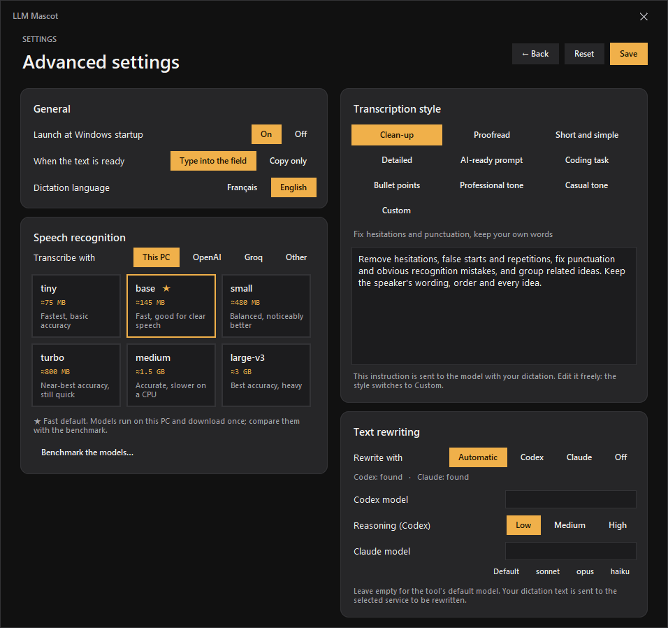
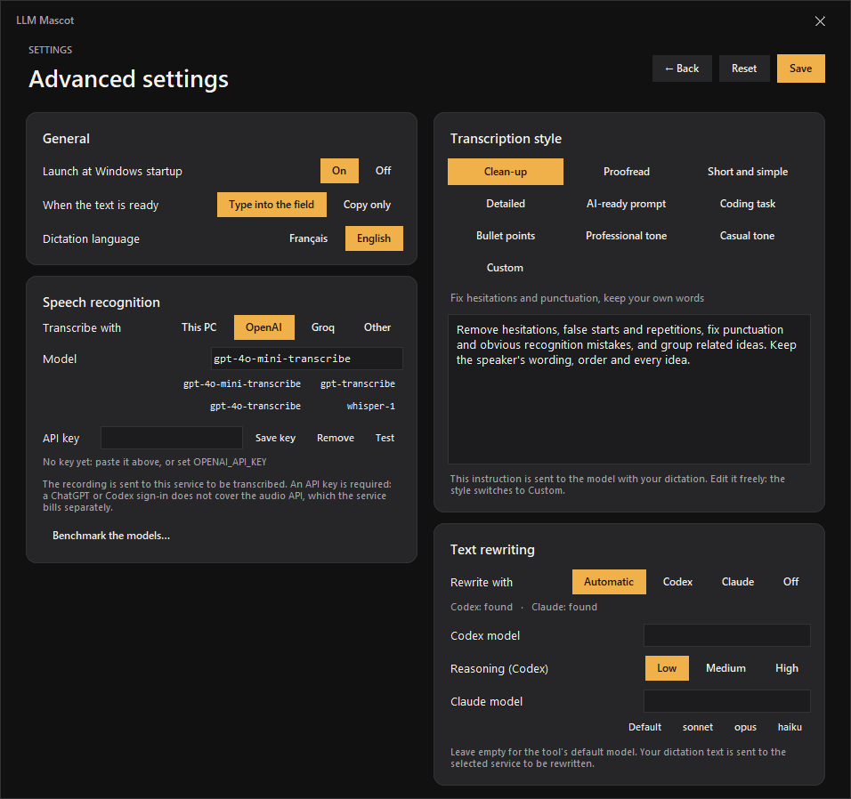

<div align="center">

# 🐶 LLM Mascot

**A tiny desktop companion for Windows that shows how much of your AI quota is left and types what you say.**

Talk to it, it transcribes on your PC, optionally polishes the text with Codex, and drops the result into the field you were typing in — never pressing Enter for you.

[](https://github.com/NathanNT/llm-mascot/actions/workflows/ci.yml)


[](LICENSE)


**English** · [Français](README.fr.md)


&nbsp;&nbsp;


</div>

---

## ✨ What you get

| Feature | Details |
|---|---|
| **Dictation anywhere** | Click the mascot or press **Ctrl+Alt+R**, speak, click again. French and English, transcribed **locally** with [faster-whisper](https://github.com/SYSTRAN/faster-whisper). |
| **Inserted, never sent** | The text is typed into the field that had focus (no clipboard, no Enter key). If you switched windows, a button lets you insert it later. |
| **Optional rewrite, your style** | Codex or Claude can clean up, proofread, shorten, expand or restructure what you said, using a preset style or your own instruction. Without either, the raw text is inserted. |
| **Usage at a glance** | Hover the gauge to see Codex usage windows, reset times and credits. Claude shows a one-click link to its usage page — no invented numbers. |
| **AI shortcut rail** | Round buttons for Claude, ChatGPT and **anything you add**: a website, a local web app, a program, a folder. Icons are fetched automatically. |
| **Real personality** | Nine reactions per mascot: it waves when you arrive, listens while you talk, reads while it thinks, jumps on success, collapses on errors, runs while you drag it. |
| **Make it yours** | Change mascot, size, theme (dark / warm light), side of the rail and language (English / Français) from a built-in settings window. |
| **Private by design** | Audio never leaves your PC, nothing is stored on disk, no telemetry. |

## 🚀 Install in one minute

**Requirements:** Windows 10 or 11, [Python 3.10+](https://www.python.org/downloads/) (`winget install Python.Python.3.12`), a microphone.

```powershell
git clone https://github.com/NathanNT/llm-mascot.git
cd llm-mascot
.\install.bat
```

Or download the ZIP from GitHub, extract it and double-click **`install.bat`**. It creates a private environment, installs the dependencies, adds a desktop shortcut and starts the mascot.

| Option | What it does |
|---|---|
| `.\install.ps1 -Startup` | Also start the mascot when Windows starts |
| `.\install.ps1 -DownloadModel` | Download the speech model now (≈150 MB) instead of at the first dictation |
| `.\uninstall.ps1` | Remove the shortcuts |
| `run.bat` | Start it by hand |

> The speech model is downloaded once, the first time you dictate. After that everything works offline.

## How to use it

1. **Hover the mascot** – it waves and reveals two round buttons and the shortcut rail.
2. **Hover the gauge** (above) to open the **usage** panel. **Hover the microphone** (below) to open the **dictation** panel.
3. **Click in any text field**, then click the mascot (or press **Ctrl+Alt+R**), speak, and click again.
4. The text appears at the caret, after whatever you had already typed. Nothing is sent: you press Enter yourself. Line breaks are typed as Shift+Enter.
5. **Drag** the mascot anywhere; every panel follows it. **Right-click** for the menu.

<div align="center">

<br><sub>Ready · Listening (live microphone level) · Processing · Text ready to insert · Error with retry</sub>
</div>

## 🎭 Mascots

<div align="center">

</div>

The classic animated Windows assistants work out of the box, each with dozens of animations. Here they are at work while the app transcribes and rewrites a dictation:

<div align="center">

</div>

- **Clippy, Merlin, Genie, Rocky, Peedy, F1, Genius, Rover XP…** use the clippy.js format. They are Microsoft's artwork, so they are **not included** in this repository; download them onto your own machine, for your own use, with:
  ```powershell
  .venv\Scripts\python tools\get_agents.py --list
  .venv\Scripts\python tools\get_agents.py Clippy Merlin Genie
  ```
  They receive the same events as every mascot (greeting, listening, processing, congratulation, alert…) and play their idle animations at random.
- **A bundled fallback** – a simple original dog (nine reactions) so the app works before you download anything.
- **Your own images** – PNG, GIF or WebP dropped in `mascots/` (or imported from the settings window). A 1536 × 1872 PNG laid out like the atlas below plays all nine reactions.
- **Codex pets** – if the Codex extension is installed, its pets appear automatically in the settings window and play the same nine reactions (they are read in place, never copied).

<details>
<summary><b>Sprite atlas layout</b> (for creating your own mascot)</summary>

An atlas is a transparent PNG of **8 columns × 9 rows of 192 × 208 px cells** (1536 × 1872). Unused cells stay empty.

| Row | Clip | Frames | Played when |
|---|---|---|---|
| 0 | idle | 6 | resting (loops) |
| 1 | run right | 8 | dragging to the right |
| 2 | run left | 8 | dragging to the left |
| 3 | wave | 4 | you hover the mascot |
| 4 | jump | 5 | text is ready or inserted |
| 5 | fail | 8 | an error occurred |
| 6 | wait | 6 | listening (loops) |
| 7 | sniff | 6 | spare clip |
| 8 | read | 6 | processing (loops) |

`python tools/make_default_mascot.py` regenerates the bundled atlas and is a good starting point.
</details>

## Shortcut rail

The rail on the side of the mascot opens your AI tools in one click. Press **＋** (or use *Customize → Shortcuts*) and enter:

- a website: `https://chatgpt.com`
- a local web app: `http://localhost:3000`
- a program or shortcut: `C:\Program Files\App\app.exe`, a `.lnk`, a folder

The icon is the site's favicon or the file's Windows icon. Right-click a button to open or remove it. Up to eight shortcuts.

<div align="center">

</div>

<div align="center">
Dark by default, with a warm light theme:<br>

</div>

## Advanced settings

*Customize → Advanced settings* groups the options that change how dictation behaves.

<div align="center">

</div>

| Setting | What it does |
|---|---|
| **Launch at Windows startup** | Starts the mascot when you sign in (a per-user entry, no admin rights). Applied when you press *Save*. |
| **When the text is ready** | *Type into the field* (default) or *Copy only* to the clipboard. |
| **Transcribe with** | *This PC* (default, private, offline) or an external service: **OpenAI** (`gpt-4o-mini-transcribe`, the fast and cheap one), **Groq** (`whisper-large-v3-turbo`, very fast, free tier) or **Other** (any OpenAI-compatible address). If the service is unreachable or out of credit, the local model takes over when it is installed. |
| **Speech model** (This PC) | `tiny` (≈75 MB) to `large-v3` (≈3 GB). **`base` (★) is the fast default**, loaded in the background at start-up so the first dictation answers at once. For technical vocabulary, `turbo` or an external service is usually much more accurate: measure it with the benchmark. A model is downloaded once, the first time it is used. |
| **Rewrite with** | *Automatic* (Codex if available, else Claude), *Codex*, *Claude*, or *Off* to always insert the raw transcript. |
| **Codex / Claude model** | The model each tool uses. Empty means the tool's own default; for Claude you can type an alias such as `sonnet`, `opus` or `haiku`, or a full model name. |
| **Transcription style** | The editing instruction sent with your dictation. Choose a preset or write your own. |

The styles: **Clean-up** (hesitations and punctuation, your own words), **Proofread** (spelling and grammar only, nothing else changes), **Short and simple**, **Detailed** (spells out what is implied, never invents), **AI-ready prompt**, **Coding task**, **Bullet points**, **Professional tone**, **Casual tone**, and **Custom**. Edit the text of any preset and it becomes *Custom*.

<div align="center">

</div>

#### An external transcriber: API key, not your ChatGPT login

OpenAI's and Groq's speech APIs are paid or metered **per API key**. A ChatGPT or Codex sign-in does not include them, so there is no way to spend your subscription credits on transcription; the app does not read your ChatGPT/Codex login for this. Create a key on the provider's site, paste it in *API key* and press *Save key*: it is encrypted for your Windows account (DPAPI) and never written to `settings.json` in clear text. Alternatively set the `OPENAI_API_KEY` / `GROQ_API_KEY` environment variable. *Test* checks the key without spending anything. When you pick a service, **the recording is sent to it**.

For speed, leave the defaults: `gpt-4o-mini-transcribe` (OpenAI) or `whisper-large-v3-turbo` (Groq) are the small, fast models, and dictation is an easy task for them. The local `base` model is the private alternative.

#### Why the "AI-ready prompt" and "Coding task" styles look the way they do

They follow what Anthropic's and OpenAI's prompting guides agree on: be clear and direct, put the task first, add the context and the reason, list concrete requirements, say what to do rather than what to avoid, state the output format, keep names and identifiers exact, and never pad. The styles turn a rambling dictation into exactly that shape without inventing anything. Sources: [Claude prompting best practices](https://platform.claude.com/docs/en/build-with-claude/prompt-engineering/claude-prompting-best-practices) and [OpenAI prompt engineering](https://developers.openai.com/api/docs/guides/prompt-engineering).

Claude is used through [Claude Code](https://docs.claude.com/en/docs/claude-code) in print mode with every tool disabled and no saved session, so it only ever rewrites text.

## Benchmark your own words

Which model is best depends on *your* vocabulary. The benchmark answers that in a minute: type the text you will read, record yourself reading it once, tick the models, and every one of them transcribes **that same recording**. Each is scored against your text (word errors, substitutions, deletions, insertions) and timed, and you see exactly which words went wrong.

<div align="center">

</div>

- Open it from *Customize → Advanced settings → Benchmark the models…* or from the mascot's right-click menu.
- Models that are not installed show their download size and are unticked; services (OpenAI, Groq) appear when a key is set and run in parallel with the local models. Nothing is sent anywhere unless you tick a service.
- The summary names the **most accurate**, the **fastest**, and the **best balance** (the fastest model within 2 points of the most accurate one). Timing excludes the one-off model load, which is reported separately.
- *Copy results* puts a Markdown table on the clipboard.

No window needed either:

```powershell
.venv\Scripts\python benchmark.py --audio talk.wav --text what-i-read.txt --models base,turbo,groq --lang en
```

## Configuration

Everything you change in the settings window is saved to `settings.json` (next to `rover.py`, never committed). A few advanced options are only in the file:

```jsonc
{
  "ui_language": "auto",        // "auto" follows Windows, or "en" / "fr"
  "language": "en",             // dictation language: "en" or "fr" (also the FR/EN switch in the panel)
  "insert": "type",             // "type" types at the caret; "copy" only puts the text on the clipboard (paste with Ctrl+V)
  "whisper_model": "base",      // local model: "tiny", "base", "small", "turbo", "medium", "large-v3"
  "transcription": {
    "engine": "local",          // "local", "openai", "groq" or "custom"
    "model": "",                // empty = the fast default of the service
    "base_url": "",             // "custom" only: an OpenAI-compatible address, https (http only for localhost)
    "api_key": ""               // written by the app, encrypted; you can use an environment variable instead
  },
  "quotas_url": "",             // optional usage service, see below
  "rewrite_provider": "auto",   // "auto", "codex", "claude" or "off" (insert the raw transcript)
  "rewrite_style": "faithful",  // a preset id, or "custom" to use "rewrite_prompt"
  "rewrite_prompt": "",
  "claude": { "model": "" },    // empty = Claude's default; "sonnet", "opus", "haiku" or a full model name
  "codex": {
    "home": "",                 // Codex profile folder, default %CODEX_HOME% or ~/.codex
    "model": "",                // empty = Codex default
    "reasoning": "low",         // minimal | low | medium | high
    "auth_store": ""            // "", "file", "keyring" or "auto"
  }
}
```

### Codex rewrite (optional)

If the [Codex CLI](https://github.com/openai/codex) is on your `PATH` and signed in, Rover pipes the transcript through `codex exec` in a read-only sandbox with tools disabled, only to fix hesitations and punctuation. Each rewrite uses a little of your Codex quota. Choose *Off* under *Rewrite with* (or `"rewrite_provider": "off"`) to skip it.

### Usage panel (optional)

The panel reads **local** JSON from `quotas_url`, which any small service of yours can provide. It understands the shape returned by Codex's rate-limit API:

```jsonc
{ "now": 1790000000,
  "accounts": [{ "name": "Account 1",
    "metrics": { "last_success_at": 1789999990,
      "limits": { "rateLimits": {
        "planType": "pro",
        "primary":   { "usedPercent": 38, "windowDurationMins": 300,   "resetsAt": 1790010000 },
        "secondary": { "usedPercent": 61, "windowDurationMins": 10080, "resetsAt": 1790400000 },
        "credits":   { "hasCredits": true, "balance": "1250" } } } } }] }
```

Without `quotas_url` the panel says so and the rest of the app works normally. Claude's plan usage is not exposed by any local API, so the panel only links to [claude.ai/settings/usage](https://claude.ai/settings/usage) when a local Claude install is detected.

## How it is built

```
rover.py        the application: windows, hover logic, dictation flow, settings window
ui_kit.py       anti-aliased panels, icons and SVG paths drawn with Pillow (no image assets for UI)
layered.py      per-pixel-alpha windows (UpdateLayeredWindow): clean edges, real fades
mascots.py      sprite atlases, clippy.js character packs, GIFs – and the event → animation mapping
voice.py        microphone capture and faster-whisper transcription
transcribe.py   optional external speech service (OpenAI, Groq…) with local fallback
benchmark.py    compare speech models on your own words (window or command line)
scoring.py      word error rate and diff of a transcript against the text that was read
core.py         optional Codex rewrite and usage reading
settings.py     preferences, shortcut list, mascot discovery
windows.py      hotkey, focus tracking, text insertion (SendInput), multi-monitor placement
i18n.py         English source strings + French translation
tools/          install helpers, asset generators, screenshot renderer
tests/unit      headless tests (run in CI)        tests/gui   checks that need a real desktop
```

Design notes: windows are borderless top-levels; buttons and the rail are true per-pixel-alpha layered windows, bubbles use a colour key with crisp edges so Tk widgets can live inside them.

## Development

```powershell
python -m venv .venv
.venv\Scripts\pip install -r requirements-dev.txt
.venv\Scripts\python -m pytest -q tests            # unit tests, no display needed
.venv\Scripts\python tests\gui\check_drag.py       # drag/hover checks on a real desktop
.venv\Scripts\python tests\gui\check_animation.py  # animations, packs and shortcuts
.venv\Scripts\python tools\make_screenshots.py --lang en --theme dark --out docs\img\en --gif
```

Adding a language: translate the strings in `i18n.py` (a unit test checks that every `tr("…")` string has a translation).

## Troubleshooting

| Symptom | Fix |
|---|---|
| *"Microphone unavailable"* | Windows Settings → Privacy → Microphone → allow desktop apps. |
| *"Whisper model unavailable"* | The first dictation needs internet to fetch the model; run `install.ps1 -DownloadModel` while online. |
| Ctrl+Alt+R does nothing | Another app owns the shortcut; click the mascot instead. |
| The text is typed in the wrong window | Click in the target field *before* dictating; the mascot remembers the last window you used. |
| Typing is unreliable in a particular app | Set `"insert": "copy"`: the text goes to the clipboard and you paste it yourself. The panel also has a **Copy** button and the right-click menu has *Copy last text*. |
| "The API key was rejected" | Check the key on the provider's site; ChatGPT subscriptions do not work here (see above). Use *Test* in the advanced settings. |
| Some of my draft was replaced | The text is typed at the caret, so a *selected* passage is replaced like any typing. The mascot never takes the keyboard focus when you click it, so your caret and draft stay untouched. |
| Something crashed | Look at `rover.log` next to `rover.py`. |

## Privacy & security

- By default audio is processed in memory by a local model and is never written to disk or uploaded. Only if you choose an external transcription service is the recording sent to it, and the API key is stored encrypted for your Windows account.
- Prompts are not stored. The optional Codex rewrite sends the **transcript text** to OpenAI through your own Codex session, like any Codex prompt.
- Account credentials stay in their usual places; the app never reads them.
- Shortcut icons are fetched only from the addresses you add.

## License and credits

MIT © NathanNT. See [`LICENSE`](LICENSE) and [`NOTICE.md`](NOTICE.md).

Clippy and the other Microsoft Agent characters are the property of Microsoft and appear in screenshots only to show compatibility; OpenAI, ChatGPT, Codex and Claude names and logos belong to their owners and are used to label shortcuts. This project is not affiliated with any of them.
